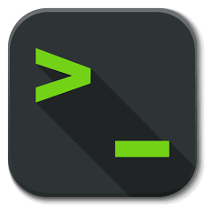

# Claude Terminal Desktop Extension (DXT)

<div align="center">
  
  
  **Full terminal access for Claude Desktop**
  
  [](https://github.com)
  [](https://nodejs.org)
  [](https://github.com)
</div>

## Overview

A powerful Desktop Extension for Claude that provides comprehensive terminal access and command execution capabilities. Built with a modular architecture for easy extensibility and maintenance!

## 🚨 Security Warning

**This extension grants Claude full terminal access to your system.** It can:
- Execute any command you can run
- Read, write, and delete files
- Manage processes and services
- Access environment variables
- Perform system administration tasks

Only use with trusted Claude instances and carefully review all commands before execution.

## ✨ Features

### Core Capabilities
- **🖥️ Command Execution** - Run shell commands with configurable timeouts and error handling
- **📜 Script Execution** - Execute scripts in multiple languages (Python, Node.js, Bash, PowerShell, etc.)
- **📊 Process Management** - List, filter, and terminate running processes
- **💻 System Information** - Retrieve comprehensive system details
- **📁 File Operations** - Read, write, copy, move, and delete files with rich metadata
- **📂 Directory Management** - Create, list, and manage directories with detailed summaries
- **🌍 Cross-Platform** - Full support for Windows, macOS, and Linux

### Technical Features
- **Modular Architecture** - Clean separation of tools for easy maintenance
- **Tool Registry System** - Dynamic tool registration and management
- **Configuration Management** - Runtime configuration without code changes
- **Comprehensive Error Handling** - Detailed error reporting with execution timing
- **Security Controls** - Timeouts, buffer limits, and command validation

## 📦 Installation

### Prerequisites
- Node.js 18.0.0 or higher
- Claude Desktop application
- npm (comes with Node.js)

### Quick Start

1. **Clone and install dependencies:**
```bash
cd claude-terminal-dxt
npm install
```

2. **Install DXT CLI globally:**
```bash
npm install -g @anthropic/dxt
```

3. **Package the extension:**
```bash
dxt pack .
```

4. **Install in Claude Desktop:**
   - Open Claude Desktop
   - Navigate to Settings → Extensions
   - Click "Install Extension"
   - Select the generated `.dxt` file
   - Confirm installation

## 🛠️ Available Tools

### Core System Tools

#### 1. execute_command
Execute shell commands with full control over execution environment.

**Example:**
```
Claude, run "git status" to check the repository status
```

**Parameters:**
- `command` (required) - The command to execute
- `working_directory` - Set execution directory
- `timeout` - Max execution time (default: 30s, max: 300s)
- `environment` - Custom environment variables

#### 2. execute_script
Run scripts with specified interpreters.

**Example:**
```
Claude, run this Python script:
import os
print(f"Current directory: {os.getcwd()}")
```

**Supported Interpreters:**
- `bash`, `sh` - Shell scripts
- `powershell`, `cmd` - Windows scripts
- `python`, `python3` - Python scripts
- `node` - JavaScript/Node.js
- `perl`, `ruby` - Other scripting languages

#### 3. get_system_info
Retrieve detailed system information.

**Returns:**
- Platform, architecture, and OS details
- CPU information and core count
- Memory usage statistics
- Node.js version
- Environment variables count
- System directories

### Process Management Tools

#### 4. list_processes
List and filter running processes.

**Parameters:**
- `filter` - Regex pattern to filter processes
- `limit` - Max processes to return (default: 50, max: 500)

#### 5. kill_process
Terminate processes safely.

**Parameters:**
- `pid` (required) - Process ID to terminate
- `force` - Force kill if normal termination fails
- `signal` - Specific signal to send (SIGTERM, SIGKILL, etc.)

### File Operation Tools 

#### 6. file_read
Read file contents with comprehensive metadata - better than `cat`/`type`.

**Example:**
```
Claude, read the package.json file and analyze the dependencies
```

**Parameters:**
- `file_path` (required) - Path to file to read
- `encoding` - File encoding (default: utf8)

**Returns:**
- File content with metadata
- File statistics and permissions
- Content type detection
- Size and modification info

#### 7. file_write
Write content to files with safety features - better than shell redirection.

**Example:**
```
Claude, create a new config file with these settings: {...}
```

**Parameters:**
- `file_path` (required) - Path to file to write
- `content` (required) - Content to write
- `encoding` - File encoding (default: utf8)
- `create_directories` - Create parent directories
- `backup` - Create backup before overwriting

#### 8. file_operations
Perform file operations (copy, move, delete) - safer than `cp`/`mv`/`rm`.

**Example:**
```
Claude, make a backup copy of important.txt before we modify it
```

**Parameters:**
- `operation` (required) - copy, move, or delete
- `source` (required) - Source file path
- `destination` - Destination path (for copy/move)
- `overwrite` - Allow overwriting existing files
- `force` - Force operation (for delete)

#### 9. directory_operations
Manage directories with detailed information - better than `mkdir`/`ls`/`rmdir`.

**Example:**
```
Claude, list all files in the src directory and give me a summary
```

**Parameters:**
- `operation` (required) - create, list, delete, or exists
- `path` (required) - Directory path
- `recursive` - Create/delete recursively
- `include_hidden` - Include hidden files in listings
- `detailed` - Include file metadata in listings

## 🏗️ Architecture

The extension uses a modular architecture for maintainability and extensibility:

```
claude-terminal-dxt/
├── src/
│   ├── server.js              # Main MCP server
│   ├── tools/                 # Tool implementations
│   │   ├── base-tool.js       # Base class for all tools
│   │   ├── tool-registry.js   # Dynamic tool registration
│   │   ├── execute-command.js # Command execution tool
│   │   ├── execute-script.js  # Script execution tool
│   │   ├── system-info.js     # System information tool
│   │   ├── process-manager.js # Process management tools
│   │   ├── file-read.js       # File reading tool
│   │   ├── file-write.js      # File writing tool
│   │   ├── file-operations.js # File copy/move/delete tool
│   │   └── directory-operations.js # Directory management tool
│   ├── utils/                 # Utility functions
│   │   ├── command-utils.js   # Command execution helpers
│   │   └── file-utils.js      # File system utilities
│   └── config/                # Configuration
│       ├── constants.js       # Application constants
│       └── config-manager.js  # Runtime configuration
├── assets/
│   └── icon.png              # Extension icon
├── manifest.json             # Extension manifest
└── package.json              # Dependencies
```

## 🔧 Configuration

The extension supports runtime configuration via `~/.claude-terminal/config.json`:

```json
{
  "maxBufferSize": 10485760,
  "defaultTimeout": 30000,
  "maxTimeout": 300000,
  "securityMode": "standard",
  "commandWhitelist": [],
  "commandBlacklist": [],
  "enableLogging": true
}
```

### Security Modes
- **standard** - Normal operation with blacklist checking
- **strict** - Only whitelisted commands allowed

## 👨‍💻 Development

### Adding New Tools

1. Create a new tool class extending `BaseTool`:
```javascript
// src/tools/my-tool.js
import { BaseTool } from "./base-tool.js";

export class MyTool extends BaseTool {
  constructor() {
    super("my_tool", "Tool description", inputSchema);
  }
  
  async run(args) {
    // Implementation
  }
}
```

2. Register in the tool registry
3. Export from index.js

See [DEVELOPER.md](DEVELOPER.md) for detailed development guide.

### Testing

Run the test suite:
```bash
npm test
```

Run server in debug mode:
```bash
npm run dev
```

## 🔒 Security Considerations

### Risks
- **Full System Access** - Can execute any command the user can run
- **File System Access** - Complete read/write/delete capabilities
- **Network Access** - Can make network connections
- **Process Control** - Can start and stop processes
- **Environment Access** - Can read all environment variables

### Best Practices
1. **Review Commands** - Always review before execution
2. **Use Whitelisting** - Enable strict mode for production
3. **Monitor Logs** - Check execution logs regularly
4. **Limit Scope** - Use working directories to restrict access
5. **Regular Updates** - Keep extension updated for security patches

## 📝 License

MIT License - see LICENSE file for details

## 🤝 Contributing

Contributions are welcome! Please:
1. Follow the existing code structure
2. Add tests for new functionality
3. Update documentation
4. Test on multiple platforms
5. Follow security best practices

## 📚 Resources

- [DXT Documentation](https://github.com/anthropics/dxt)
- [MCP Protocol Specification](https://modelcontextprotocol.io)
- [Installation Guide](INSTALL.md)
- [Developer Guide](DEVELOPER.md)

## 🐛 Troubleshooting

### Common Issues

**Permission Denied**
- Ensure Claude has necessary permissions
- Check file/directory ownership

**Command Not Found**
- Verify command is installed
- Check PATH environment variable

**Timeout Errors**
- Increase timeout for long operations
- Check for hanging processes

**Large Output Truncated**
- Output limited to 10MB
- Consider writing to file instead

## 📊 Version History

### v1.0.0 (Current)
- ✅ **Modular Architecture** - Clean tool registry system with base classes
- ✅ **Enhanced Error Handling** - Comprehensive error reporting with execution timing
- ✅ **Configuration Management** - Runtime configuration without code changes
- ✅ **Cross-Platform Support** - Full compatibility with Windows, macOS, and Linux
- ✅ **Security Controls** - Timeouts, buffer limits, path validation, and permission checks
- ✅ **9 Comprehensive Tools** - Complete terminal and file system access

#### Tool Categories:
- **System Tools** (3): Command execution, script running, system information
- **Process Management** (2): List and terminate processes
- **File Operations** (4): Read, write, copy/move/delete files, directory management

### Planned Features
- 🔄 **Network Diagnostic Tools** - Ping, netstat, connection testing
- 🔄 **Service Management** - Start/stop/restart system services
- 🔄 **Git Integration** - Structured git operations with rich output
- 🔄 **Package Manager Support** - npm, pip, cargo, apt operations
- 🔄 **Environment Management** - Variable manipulation and virtual environments

---

<div align="center">
  <strong>Built with security and extensibility in mind</strong>
  <br>
  Use responsibly • Review commands • Stay secure
</div>
